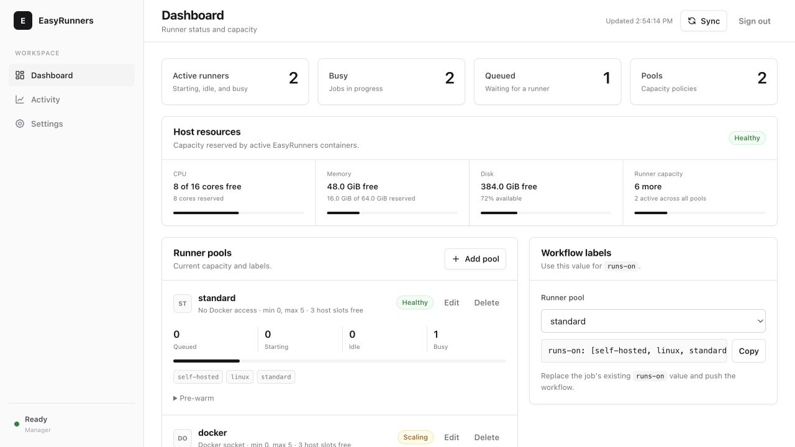
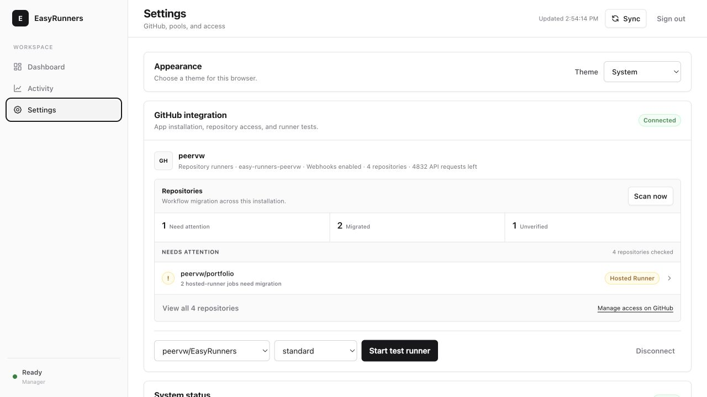

# EasyRunners

**The easy way to run GitHub Actions on your own hardware.**

Deploy one Compose stack, connect GitHub, and change one workflow line. EasyRunners starts a clean
runner when a matching job arrives and removes it when the job is done.



## Your first self-hosted job

### 1. Deploy

```bash
git clone https://github.com/peervw/EasyRunners.git easy-runners
cd easy-runners
export PUBLIC_URL=https://runners.example.com
docker compose up -d --build
docker compose logs manager
```

Compose builds the manager and universal runner image locally. The first boot prints a one-time
administrator password in the manager logs.

Using Dokploy? Select `compose.yaml`, set `PUBLIC_URL`, route your HTTPS domain to the `manager`
service on port 8080, and deploy. The Compose file already includes its volume and Docker socket.

### 2. Connect GitHub

Open `PUBLIC_URL`, sign in with the one-time password, and choose **Connect GitHub**. Enter your
account URL, such as `https://github.com/peervw`, and follow GitHub's installation screen. Select
**Only select repositories** unless every repository in the account is trusted.

EasyRunners creates the private GitHub App with the required permissions and discovers the selected
repositories automatically. No registration token, App private key, or webhook secret needs to be
copied by hand.

Need another personal account or organization later? Open **Settings → GitHub integrations** and
choose **Add account**. Each account gets its own private App and repository-access controls; all of
them share the same runner pools and host capacity.

### 3. Change one line

Replace the job's current `runs-on` value:

```yaml
# before
runs-on: ubuntu-latest

# Tests, linting, Rust, and other jobs that do not invoke Docker
runs-on: [self-hosted, linux, standard]

# Jobs that build or run Docker containers
runs-on: [self-hosted, linux, docker]
```

Push the workflow. Watch it move through **queued → starting → busy → complete** while EasyRunners
creates one ephemeral runner and cleans up its container and workspace afterward. Future matching
jobs work the same way.

## Everything in one place

The dashboard shows live runners, queue state, pool capacity, and host CPU, memory, and disk. It also
gives you the exact `runs-on` value for every pool, so there is no label guessing.



_Screenshots show the current interface with example runner activity._

The GitHub settings page keeps larger installations manageable: search and filter repositories,
see which ones have migrated, inspect jobs still using GitHub-hosted runners, and copy the correct
replacement labels. Scans are read-only; EasyRunners does not edit workflow files.

Behind that simple setup:

- Jobs get a fresh container filesystem and workspace.
- Runners scale to zero and disappear after one job.
- Each GitHub account or organization has an isolated App installation and can expose many selected
  repositories.
- The universal runner image includes Docker tooling, Python, Rust, and common build tools.
- The standard pool has no Docker socket; the Docker pool is available when a job needs it.
- No Kubernetes, external database, queue, or registry login is required.

GitHub still owns workflows, scheduling, logs, secrets, and results. EasyRunners supplies official
self-hosted runner capacity when it is needed.

## Requirements

- x86_64 or ARM64 Linux
- Docker Engine and Docker Compose v2
- An HTTPS URL reachable by your browser (public for instant webhook scaling; private/LAN works with
  polling)
- One or more trusted GitHub repositories, or a GitHub organization

Downloading and configuring GitHub's runner means accepting the applicable
[GitHub Customer Agreement](https://github.com/customer-terms).

## Setup notes

For personal accounts, EasyRunners creates repository-specific runners: a job from repository A
cannot run on a runner registered to repository B. One App installation can still serve every
repository selected on GitHub. For organizations, the optional shared-runner mode registers at the
organization level and should be restricted with GitHub runner groups.

EasyRunners can connect several GitHub accounts and organizations at once. GitHub private Apps are
owned by one account, so EasyRunners creates one App per connected owner instead of asking you to
maintain a shared public App. Webhook secrets, installation tokens, repository scans, and runner
registrations remain tied to that connection. The same account cannot be added twice to one
deployment, which prevents duplicate job events and ambiguous routing.

If login expires or the browser is closed during setup, sign in again and use **Continue** next to
the pending account. **Disconnect** clears that account locally; remove an abandoned App separately
in GitHub settings if desired. EasyRunners waits for active jobs and runners before allowing a
connection to be removed.

EasyRunners stores the generated App private key and webhook secret in the `easy-runners-data`
volume with mode `0600`. It verifies that GitHub's returned installation belongs to the configured
target before accepting it.

The manager binds `127.0.0.1:8080` by default. Dokploy/Portainer deployments can route to the
`manager` service on port 8080 through the Compose network. For a host reverse proxy, proxy to
`http://127.0.0.1:8080`. Do not expose port 8080 directly to the internet without HTTPS.

### Private or LAN installation

Turn off **Instant scaling with a public HTTPS webhook** during onboarding, or set
`WEBHOOK_ENABLED=false`. GitHub does not need inbound network access to the manager; queued jobs are
discovered through periodic REST polling. Scale-up can therefore take up to
`QUEUE_POLL_INTERVAL` seconds. `PUBLIC_URL` remains canonical and is never inferred from request
headers.

### Password recovery

```bash
docker compose exec manager easyrunners admin reset-password
```

The command invalidates all sessions and prints a new one-time password.

## What happens when a job queues

```text
workflow_job queued webhook        periodic REST reconciliation
              │                                  │
              └──────────────┬───────────────────┘
                             ▼
                    per-pool scheduler
                             │
            short-lived registration token from GitHub
                             │
                             ▼
       official actions/runner container --ephemeral
                             │
                 exactly one GitHub Actions job
                             │
                             ▼
          automatic de-registration + container removal
```

Every runner receives a new container filesystem and `_work` directory. Registration tokens are
requested just in time, never stored, and never written to logs. Containers are labeled so the
manager can adopt or clean them after a restart. See
[the architecture decision](docs/ARCHITECTURE.md) for the deeper design.

## GitHub permissions

The manifest requests only the permissions required by the selected scope:

| Scope | GitHub App permission | Why |
|---|---|---|
| Selected repositories | Actions: read | Receive `workflow_job` and reconcile workflow jobs |
| Selected repositories | Administration: write | Create/list/delete repository-specific runner registrations |
| Organization | Actions: read | Observe jobs in installed repositories |
| Organization | Self-hosted runners: write | Create/list/delete organization runners |

The App subscribes only to `workflow_job`. GitHub's registration token expires after one hour;
EasyRunners obtains a fresh token for the requesting repository for every container. The dashboard
shows GitHub's selected repository list and warns when the installation is granted **All
repositories**. Organization owners should also use runner groups and selected-repository policies.

### Manual GitHub App or PAT setup

For headless installations set `GITHUB_AUTH_MODE=app` and provide `GITHUB_SCOPE`, account fields,
`GITHUB_APP_ID`, `GITHUB_INSTALLATION_ID`, and `GITHUB_APP_PRIVATE_KEY_PATH`. Mount the PEM into the
manager container if it is not in `/data`. `GITHUB_REPO` is optional for App authentication because
the installation's selected repositories are discovered automatically; PAT repository mode still
requires it.

For development only, set `GITHUB_AUTH_MODE=pat` and `GITHUB_TOKEN`. Classic PATs require `repo` for
private repositories or `admin:org` for organization runners. GitHub Apps are recommended because
their installation tokens are short-lived and repository access is explicit.

## One image, as many pools as you need

All built-in pools use the same universal runner image. Pools are lightweight scheduling and
security boundaries—not separate language images. Use them when jobs need different labels,
capacity, resource limits, credentials, or Docker access. Specify `image` on an individual pool only
when a genuinely custom environment is required.

The universal image is somewhat larger than a language-minimal image, but a self-hosted Docker host
builds and stores it once. In return, deployment has one image lifecycle, warm local layers, and no
label-to-image surprises.

Defaults live in `config.yaml`; secrets remain in the environment or protected data volume. Pools
can also be edited in the dashboard or imported/exported as YAML. Dashboard overrides persist in
`/data` and take precedence after restart:

```yaml
runner_pools:
  standard:
    labels: [self-hosted, linux, standard]
    aliases: [ci, rust] # temporary compatibility for existing workflows
    min: 0
    max: 5
    priority: 20
    cpu: 4
    memory: 8g
    docker_mode: none

  docker:
    labels: [self-hosted, linux, docker]
    min: 0
    max: 5
    cpu: 4
    memory: 8g
    job_timeout: 3600
    max_lifetime: 3900
    docker_mode: socket

  deploy:
    labels: [self-hosted, linux, deploy]
    min: 0
    max: 1
    priority: 10
    cpu: 2
    memory: 4g
    docker_mode: none
    environment_from: [DEPLOY_TOKEN]
```

GitHub automatically assigns `self-hosted`, `Linux`, and the native architecture label (`X64` or
`ARM64`); EasyRunners detects the host architecture and passes only custom labels to
`config.sh`. Matching is case-insensitive, and a pool that explicitly requests a different
architecture is rejected. When multiple pools match, the pool with the fewest extra labels wins,
followed by highest priority and pool name. Duplicate label sets are rejected at startup. Give
sensitive pools a unique discriminator such as `deploy`.

Use a pool with:

```yaml
runs-on: [self-hosted, linux, standard] # no Docker socket
runs-on: [self-hosted, linux, docker]
```

The `standard` pool is the recommended default for ordinary tests, linting, compilation, and Rust
work.
It uses the same universal image without mounting the root-equivalent Docker socket. Choose the
`docker` label only for jobs that actually run Docker or Compose. Both pools scale to zero.

See [Python CI](examples/python-ci.yaml), [Rust CI](examples/rust-ci.yaml),
[GHCR build](examples/docker-ghcr.yaml), and [deployment](examples/deploy.yaml) examples.

### Fast Rust jobs without a second image

The universal image includes rustup, the stable minimal Rust toolchain, Clippy, rustfmt, `clang`,
`lld`, CMake, OpenSSL headers, `pkg-config`, and Protobuf. Compose builds and stores that image once;
every ephemeral runner reuses its local read-only layers, so Rust does not require another
build or image download.

Rust jobs use the `standard` pool by default. It has the complete Rust toolchain but no Docker
socket. Use the `docker` pool only when the job also builds or runs containers.

Rust workflows use GitHub's remote Actions cache through `Swatinem/rust-cache`, pinned to an
immutable commit. It keys Cargo downloads and dependency build artifacts using the compiler,
Cargo manifests and lockfiles, toolchain files, and relevant build environment. No Cargo directory
is shared directly between repositories or runner containers.

Set `RUST_TOOLCHAIN` before building the image to bake a specific channel or version instead of
`stable`. A repository-level `rust-toolchain.toml` remains the source of truth; when it asks for a
toolchain not present in the image, install that toolchain in the workflow or rebuild the universal
image with the same pin.

Recognizable built-in `ci`/`rust` and `default` dashboard overrides migrate automatically to
`standard` and `docker` on restart; EasyRunners keeps a backup of the old JSON in its database.
Custom variants are preserved. The standard runner temporarily registers `ci` and `rust` aliases,
so existing workflows continue to run while their labels are changed to `standard`. Workflows
already using the `docker` label do not need to change.

### Connect a Rust repository

1. In the GitHub App installation, ensure the Rust repository is selected. Reconnecting EasyRunners
   is not necessary when adding another repository to the same installation.
2. Confirm that the dashboard readiness check finds the runner image and that the `standard` pool
   appears.
3. In the target repository, copy `examples/rust-ci.yaml` to `.github/workflows/rust-ci.yml`, or copy
   the Rust `runs-on` line from the dashboard.
4. Commit and push the workflow. A job requesting
   `[self-hosted, linux, standard]` queues, EasyRunners starts one ephemeral runner container, and the
   container disappears after the job.

The example workflow assumes a committed `Cargo.lock` and a workspace compatible with
`--all-features`. Remove `--locked`, `--workspace`, or `--all-features` if the repository intentionally
uses a different layout.

### Scaling behavior

- `workflow_job` webhooks trigger immediate reconciliation.
- REST polling enumerates the App installation's selected repositories to repair missed events and
  restore demand after restart.
- Personal-account capacity is repository-bound. Pool maximums apply across all selected
  repositories, and the oldest queued matching jobs receive available slots first.
- A non-zero pool minimum uses the first selected repository; explicit dashboard pre-warming names
  the repository and is clearer for multi-repository installations.
- Organization polling enumerates App installation repositories because GitHub has no single API
  endpoint for all queued organization jobs grouped by runner labels.
- Starting containers count toward capacity. Busy runners are never stopped for ordinary scale-down.
- Idle excess waits for `idle_timeout` and an assignment grace period.
- Dashboard pre-warming is a temporary desired-capacity floor, not a permanent config change. A
  personal-account pre-warm always names its repository explicitly.
- Exactly one manager replica is supported.

## Docker builds and security

`docker_mode: socket` mounts `/var/run/docker.sock` and supplies Docker CLI in the runner image. This
is convenient for Docker builds, but **Docker socket access is root-equivalent access to the host**.
A workflow can inspect containers, mount host paths, and read manager secrets. Filesystem isolation
between jobs does not mitigate a malicious workflow.

Therefore:

1. Never run arbitrary or unreviewed fork pull-request code on these runners.
2. Restrict organization runners to trusted repositories and workflows.
3. Keep generic CI and production deployment in different pools and preferably on different hosts.
4. Expose deployment credentials only through the deploy pool.
5. Use `docker_mode: none` when jobs do not need Docker.
6. For hostile multi-tenant workloads, use separate VMs or ARC/scale sets rather than this socket
   architecture. Privileged Docker-in-Docker is deliberately not implemented in v1.

Runner containers are otherwise non-privileged, drop capabilities, set `no-new-privileges`, have no
published ports, run as UID/GID 1001, and receive configurable CPU, memory, PID, job, and lifetime
limits. Pool-defined host mounts deliberately weaken isolation and must be reviewed.

## Operational visibility and failure webhooks

The dashboard's host card reads Docker host CPU and memory totals plus free space on the persistent
data filesystem. It subtracts the CPU and memory limits reserved by active runner containers and
shows how many additional runners each pool can safely start within both its pool maximum and host
limits. Disk pressure below ten percent free is highlighted. These are scheduling guardrails based
on configured container limits, not a replacement for node-level utilization monitoring.

To forward operational failures to Slack-compatible relays, ntfy adapters, incident systems, or
your own service, configure a generic HTTPS webhook:

```dotenv
NOTIFICATION_WEBHOOK_URL=https://alerts.example.com/hooks/easy-runners
NOTIFICATION_WEBHOOK_SECRET=replace-with-a-random-secret
NOTIFICATION_STUCK_JOB_SECONDS=900
NOTIFICATION_COOLDOWN_SECONDS=900
```

EasyRunners sends JSON events for jobs queued past the threshold, runner startup or registration
failures, and unhealthy GitHub API connections. When a secret is set, the exact request body is
signed in `X-EasyRunners-Signature: sha256=…`. Repeated alerts are throttled by event target, and a
failed notification never blocks runner reconciliation. Configuration status and a **Send test**
button are available under **Settings → Failure notifications**.

## Dashboard, API, and metrics

All management data is authenticated. Browser mutations also require CSRF validation. Create
revocable, optionally expiring API tokens from the dashboard and choose the narrowest scope:
`metrics` can only read Prometheus metrics, `read` can inspect management data, and `manage` can
also mutate configuration. Send the token as:

```text
Authorization: Bearer ert_...
```

Endpoints:

- `GET /health` — intentionally minimal unauthenticated liveness
- `GET /api/status`, `/api/runners`, `/api/pools`, `/api/history`, `/api/usage`
- `GET /api/readiness` and `/api/version`
- `GET /api/repositories/adoption` for cached workflow-label migration status and background scan
  progress; append `?refresh=true` to start a new scan
- `GET /api/notifications` and `POST /api/notifications/test`
- `GET /api/jobs` for queued and in-progress workflow jobs
- `GET /api/diagnostics` and `/api/diagnostics/{name}` for retained runner archives; `DELETE
  /api/diagnostics` clears them
- `GET|PUT /api/settings/diagnostics` for capture, automatic cleanup, and retention settings
- `PUT|DELETE /api/pools/{pool}` and YAML pool import/export endpoints
- `POST /api/pools/{pool}/scale` with
  `{"desired": 2, "ttl_seconds": 600, "connection_id": "…", "repository":
  "owner/repository"}`
- `POST /api/readiness/test-runner?pool=standard&connection_id=…&repository=owner/repository` to
  pre-warm one runner for five minutes
- `POST /api/reconcile`
- `GET|POST /api/auth/tokens` and `DELETE /api/auth/tokens/{id}`
- `GET /api/github`, setup routes, and `POST /api/github/connections/{id}/disconnect`
- `POST /webhooks/github` — HMAC-SHA256 signed GitHub deliveries only
- `GET /metrics` — Prometheus format, requiring session or bearer token

Queued jobs include a machine-readable waiting reason such as no matching pool, runner starting,
pool capacity reached, Docker unavailable, or GitHub unavailable. Structured events include
`runner.created`, `runner.online`, `runner.job_started`,
`runner.job_finished`, `runner.removed`, `github.api_error`, and `scheduler.reconcile`. Diagnostic
archives are retained under `/data/runner-logs` for seven days by default. Treat them as sensitive.
Capture and automatic cleanup are enabled by default and can be changed under **Settings →
Diagnostics**. The theme selector under **Settings → Appearance** supports system, light, and dark
modes and is stored in the browser.

## Updating

The dashboard reads the latest tagged EasyRunners GitHub Release—including its tag, publication
time, and direct release link—and compares it with the installed package version. It separately
compares the pinned official runner version with GitHub's latest runner release. The check timestamp
is shown so stale or missing release data is visible. EasyRunners deliberately does not redeploy
itself because runner releases use a progressive rollout and production updates should remain
reviewable.

Update and rebuild from source:

```bash
git pull --ff-only
docker compose up -d --build
```

The runner is pinned and built with automatic updates disabled to avoid downloading an update for
every ephemeral container. To update it, change `RUNNER_VERSION`, `RUNNER_SHA256_X64`, and
`RUNNER_SHA256_ARM64` in `.env` using the checksums published on the official
[actions/runner releases page](https://github.com/actions/runner/releases), then rebuild. GitHub uses
a progressive rollout, so verify the expected version in the repository or organization's **Add new
self-hosted runner** page before updating.

Maintainers publish EasyRunners with Release Please. Conventional commits merged into `main` update
a release PR; merging that PR creates a `vX.Y.Z` tag, changelog entry, and GitHub Release. The
package version, lockfile root package version, and release manifest move together. Dependabot runs
weekly for the `uv` Python lockfile and every immutable GitHub Actions pin, grouping related updates
into reviewable pull requests.

## Backup and restore

Runner containers and workspaces require no backup. Back up the named data volume to retain the App
private key, webhook secret, administrator hash, API tokens, and history:

```bash
docker run --rm -v easy-runners_easy-runners-data:/data:ro \
  -v "$PWD":/backup ubuntu:24.04 \
  tar czf /backup/easy-runners-data.tgz -C /data .
```

Restore only while the manager is stopped. Protect backups as authentication secrets. If the volume
is lost, create a new App through onboarding or supply manual credentials; runner capacity itself is
reconstructed from Docker and GitHub. Rotate App private keys in GitHub and replace the stored PEM
after any suspected disclosure.

## Troubleshooting

- **No runner appears with min 0:** queue a job whose complete `runs-on` labels match a pool, or
  pre-warm one runner from the dashboard.
- **Job stays queued:** compare job labels with the effective pool labels and verify the repository
  appears in the dashboard's GitHub repository list or organization runner group.
- **GitHub disconnected:** inspect `docker compose logs manager` for permission or installation-token
  errors. Reapprove changed App permissions in GitHub.
- **Webhook rejected:** ensure `PUBLIC_URL` reaches `/webhooks/github` unchanged and the reverse proxy
  does not rewrite the request body.
- **Docker unavailable:** verify the socket mount, Docker daemon, and `DOCKER_HOST`.
- **Runner registers then exits:** inspect `/data/runner-logs` and verify the pinned runner version is
  accepted by GitHub.
- **Organization polling is slow:** rely on webhooks for fast scaling, increase the full sweep
  interval, or reduce the App's installed repository selection.

Development commands:

```bash
uv sync --all-groups
ALLOW_INSECURE_PUBLIC_URL=true DATA_DIR=./data uv run easyrunners serve
uv run pytest
uv run ruff check .
uv run mypy src
```

## License

Apache-2.0. The GitHub Actions runner is downloaded separately and governed by GitHub's terms.
